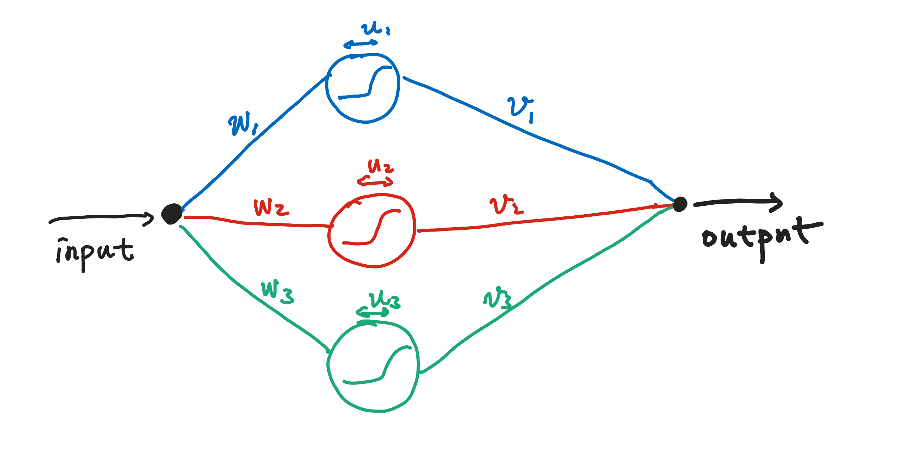

Artificial Neural Network
==========================

Basics
------------------

Artificial neural network can be used as a universal approximator. We all had the experience of guess the solution to some particular problems. Artificial neural network serves as a general one that can be used to approximate a lot of functions.

The simplest example is that we can always describe a function :math:`f(x)` as

.. math::
   y(x) = \sum_{k=1}^{N} v_k * \text{activation}( w_k * x + u_k ),

where **activation** is a function that is related to the property of single neurons. Precisely speaking, this decomposition of the function is a network composed of N neurons.

   A very simple artificial neural network.

How exactly does it work?

   
   Illustration of how ann works as an approximator.

The only problem, however, is that we need to find out the value of the parameters, thus training. For training we either need some real data that should be approximated by this network or a conservation law.

Solving Differential Equations
--------------------------------

For a differential equation, we have a natural conservation law. For example, equation

.. math::
   \frac{d}{dt}y(t)= - y(t)

means that the quantity

.. math::
   \frac{d}{dt}y(t) + y(t)

is conserved and is exactly 0. If we ever try to use ANN to approximate the function :math:`y(t)`, this conservation law should be satisfied and it's the only law that the approximator should obey.

Using the network, we know that for each argument :math:`t_i`, we should have an output

.. math::
   y_i= 1+t_i v_k f(t_i w_k+u_k).

By training, we are talking about minimization the deviation of the quantity from the conserved value. We devise a function that describes the deviation and name it the cost,

.. math::
   I=\sum_i\left( \frac{dy_i}{dt}+y_i \right)^2.

We could actually calculate :math:`dy/dt` using the approximator,

.. math::
   \frac{dy}{dt} = v_k f(t w_k+u_k) + t v_k f(tw_k+u_k) (1-f(tw_k+u_k))w_k,

where we denote the **activation** function :math:`f`. Then we can parameterize the cost function using the parameters

.. math::
   I = \sum_i \left(  v_k f(t w_k+u_k) + t v_k f(tw_k+u_k) (1-f(tw_k+u_k)) w_k + y \right)^2.

The final step is to find the parameters so that this cost is minimized.

.. admonition:: Activation function or trigger function
   :class: note

   One of the useful activation function is

   .. math::
      f(x)=\frac{1}{1+\exp(-x)}.
